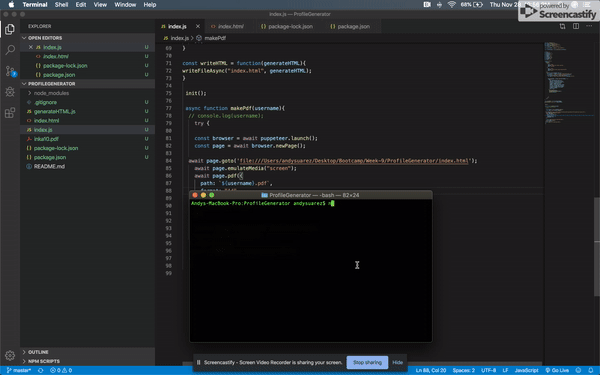

# ProfileGenerator

Creating a command-line application that dynamically generates a PDF profile from a GitHub username. The application will run once the node index.js command is ran in the CLI:

# Steps

1. The user will enter their user name from GitHub
2. The user will enter their color of preference
3. A PDF will be downloaded to their local machine

# PDF Consists of

* User's Iage
* User Handle Name
* User Location  
* GitHub Profile
* Public Repos, followers, starts, and followings
